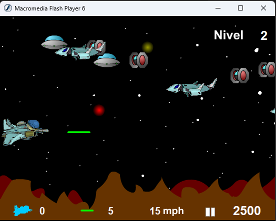

# Space Ship Game

## History

Back in the University, we worked on a "Space Ship" (Nave) Macromedia Flash game that was never fully completed. 

This project started on July 24, 2004, primarily developed by [José Carrero](mailto:josercl@gmail.com), with some input from me on [ActionScript and Flash](https://en.wikipedia.org/wiki/ActionScript). 

In the end, we achieved in a couple of hours something cool and fun that I'll never forget.

## Game Controls

* **SHIFT:** Shoot
* **ARROWS:** Move

## Download

You can download the [32-bit Windows EXE](nave.exe) or the its compressed [ZIP file](nave.zip), which works with [Wine](www.winehq.org/) on GNU/Linux. 

The original Macromedia SWF output file is also available [here](nave.swf).

## References

To convert the EXE to SWF I used the program [FardaSaz EXE to SWF](https://download.cnet.com/FardaSaz-EXE-to-SWF/3000-6676_4-10554387.html) by Aftab Developers, a company that seems to have disappeared without a trace.
